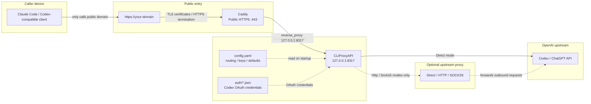
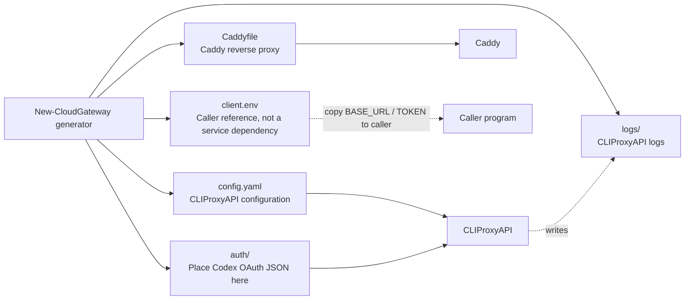

# CLIProxyAPI Cloud Gateway

[中文](README.md) | English

Run CLIProxyAPI safely on a cloud server: CLIProxyAPI listens only on local
`127.0.0.1`, while Caddy owns the public HTTPS entry point.

This project is not a multi-tenant billing platform and it is not CLIProxyAPI
itself. It is a lightweight deployment kit that generates safer, easier-to-debug
CLIProxyAPI + Caddy configuration for yourself or a small trusted user group.

Repository: <https://github.com/shuiyu486/cliproxy-cloud-gateway>

## Choose a Mode First

| Scenario | Recommended entry |
|---|---|
| Linux cloud server production deployment | `bash ./scripts/install-cloud-gateway.sh --domain api.example.com --install-dir /opt/cliproxy-gateway` |
| Generate files only | `scripts/new-cloud-gateway.sh` or `scripts/New-CloudGateway.ps1` |
| Windows as a temporary/long-term LAN gateway | `scripts/Start-CloudGatewayLan.ps1` |
| Check an existing deployment | `scripts/test-cloud-gateway-doctor.sh` or `scripts/Test-CloudGatewayDoctor.ps1` |

For first-time cloud deployment, start with "Linux Cloud One-Click Install". For the Windows + Mac LAN workflow, use "LAN Mode".

## Quick Start

### Linux Cloud One-Click Install

On a cloud server, run:

```bash
bash ./scripts/install-cloud-gateway.sh \
  --domain api.example.com \
  --install-dir /opt/cliproxy-gateway
```

The installer:

- Generates `config.yaml`, `Caddyfile`, `client.env`, `auth/`, and `logs/`.
- Downloads CLIProxyAPI and Caddy from fixed GitHub release sources when missing; existing files are not overwritten.
- Renders and enables the CLIProxyAPI systemd service from `linux/cliproxy.service.template`.
- Installs and reloads the Caddyfile.
- Runs doctor checks.
- Prints paths, domain, and status only; it does not print API keys.

If the server needs a proxy to reach Codex / ChatGPT upstream:

```bash
bash ./scripts/install-cloud-gateway.sh \
  --domain api.example.com \
  --install-dir /opt/cliproxy-gateway \
  --upstream-proxy-mode socks5 \
  --upstream-proxy-url 127.0.0.1:7897
```

For a generate-only dry run that does not change systemd/Caddy:

```bash
bash ./scripts/install-cloud-gateway.sh \
  --domain api.example.com \
  --install-dir /opt/cliproxy-gateway \
  --skip-download \
  --skip-systemd \
  --skip-caddy-reload
```

## How It Works

```text
client -> Caddy HTTPS -> CLIProxyAPI -> Codex / ChatGPT upstream
```



Key points:

- Callers only use `https://your-domain`; they do not directly reach CLIProxyAPI or upstream.
- Caddy is the only public entry point and handles HTTPS, certificates, and reverse proxying.
- CLIProxyAPI stays on the cloud server localhost and binds only to `127.0.0.1:8317`.
- `config.yaml` and `auth/*.json` feed CLIProxyAPI with routing, keys, defaults, and Codex OAuth credentials.
- Optional upstream proxy affects only outbound `CLIProxyAPI -> upstream` traffic; it does not affect callers connecting to Caddy.

## Features

- Linux cloud one-click installer can generate config, download dependencies, install systemd, and reload Caddy.
- Windows and Linux generators.
- Generates `config.yaml`, `Caddyfile`, `client.env`, `auth/`, and `logs/`.
- LAN one-click test scripts can download CLIProxyAPI and Caddy binaries when missing.
- Private-by-default listener: `host: "127.0.0.1"`.
- Caddy as the public HTTPS edge.
- Optional upstream proxy: `Direct`, `Http`, or `Socks5`.
- Automatic enabled `type=codex` OAuth JSON metadata sync.
- Generators do not print API keys to stdout.
- Windows and Linux doctor scripts.
- Carries the CLIProxyAPI hardening defaults that are relevant to cloud deployment.

## Generated Files

How Generated Files Are Used:



| File / directory | Purpose |
|---|---|
| `config.yaml` | CLIProxyAPI configuration. |
| `Caddyfile` | Caddy reverse proxy configuration. |
| `client.env` | Example environment variables for callers, including the gateway URL and the first client API key. |
| `auth/` | Place Codex OAuth JSON files here. |
| `logs/` | CLIProxyAPI log directory. |

`client.env` is not required by CLIProxyAPI or Caddy at runtime. It is only a convenience file for copying caller-side connection settings to your local machine or another host. It contains a sensitive API key and is git-ignored. Do not commit it.

## Generate Files Only

Windows:

```powershell
.\scripts\New-CloudGateway.ps1 `
  -Domain "api.example.com" `
  -OutputDir "C:\Services\cliproxy-gateway"
```

Linux:

```bash
bash ./scripts/new-cloud-gateway.sh \
  --domain api.example.com \
  --output-dir /opt/cliproxy-gateway
```

Check the generated deployment:

```powershell
.\scripts\Test-CloudGatewayDoctor.ps1 -DeploymentDir "C:\Services\cliproxy-gateway"
```

```bash
bash ./scripts/test-cloud-gateway-doctor.sh --deployment-dir /opt/cliproxy-gateway
```

## Get Codex OAuth JSON

The server does not need a graphical browser; prefer CLIProxyAPI device login from an SSH session:

```bash
cd /opt/cliproxy-gateway
./cli-proxy-api/cli-proxy-api -config ./config.yaml -codex-device-login
```

The one-click installer puts the CLIProxyAPI binary at `/opt/cliproxy-gateway/cli-proxy-api/cli-proxy-api` by default. If you installed with a custom `--binary-path`, use your actual path instead.

The command prints a login URL / device code in the terminal. Open it in your local browser and authorize the account; the server-side CLIProxyAPI process keeps waiting for the result and writes the Codex OAuth JSON into the `auth-dir` configured by `config.yaml`:

```text
/opt/cliproxy-gateway/auth/*.json
```

You can also log in with the same CLIProxyAPI version on a trusted local machine, then copy the generated JSON to the server:

```bash
scp codex*.json user@server:/opt/cliproxy-gateway/auth/
ssh user@server 'chmod 600 /opt/cliproxy-gateway/auth/*.json'
```

Notes:

- This project needs `type=codex` OAuth JSON generated by CLIProxyAPI login. Do not use `~/.codex/auth.json` directly as this OAuth file.
- The OAuth JSON is usually not bound to local hardware, but it is an account login credential. Do not commit it, paste it into logs, or share it.
- Do not keep the same OAuth JSON in long-term concurrent use on both your local machine and the server; refresh token rotation can invalidate one side.
- If a locally generated JSON fails on the server, check the server egress IP, proxy exit, account entitlement, or upstream risk controls first. That is usually not a path problem.

## Start the Gateway After Auth

If you used the Linux one-click cloud installer without `--skip-systemd` / `--skip-caddy-reload`, the installer has already created and started the systemd services. After obtaining or copying auth JSON, restart the CLIProxyAPI service so it reloads `auth/*.json`:

```bash
sudo systemctl restart cliproxy
sudo systemctl status cliproxy --no-pager
sudo systemctl status caddy --no-pager
```

View CLIProxyAPI logs:

```bash
sudo journalctl -u cliproxy -n 100 --no-pager
```

If you installed with a custom `--service-name`, replace `cliproxy` with your service name.

If you installed with `--skip-systemd`, you can first run CLIProxyAPI manually for a check:

```bash
cd /opt/cliproxy-gateway
./cli-proxy-api/cli-proxy-api -config ./config.yaml
```

If you installed with `--skip-caddy-reload`, manually install and reload the Caddyfile:

```bash
sudo cp /opt/cliproxy-gateway/Caddyfile /etc/caddy/Caddyfile
sudo caddy validate --config /etc/caddy/Caddyfile
sudo systemctl reload caddy
```

Once the services are healthy, callers only need the public URL and API key from `client.env`; see "Caller Setup".

## Auth JSON Sync

The generator scans enabled `type=codex` JSON files under `auth/`:

- missing `websockets` is set to `true`;
- explicit `websockets: false` is preserved;
- Direct mode removes stale `proxy_url`;
- Http/Socks5 mode writes the normalized `proxy_url`;
- token fields and full auth JSON are never printed.

## Upstream Proxy

`UpstreamProxyMode` controls only this leg:

```text
CLIProxyAPI -> Codex / ChatGPT upstream
```

It does not affect users connecting to your public Caddy domain.

| Mode | Behavior |
|---|---|
| `Direct` | Default. Omit `proxy-url` and remove stale auth JSON `proxy_url`. |
| `Http` | Normalize `127.0.0.1:7897` to `http://127.0.0.1:7897`. |
| `Socks5` | Normalize `127.0.0.1:7897` to `socks5://127.0.0.1:7897`. |

Prefer `Direct`. Use `Http` or `Socks5` only when the server must reach upstream through a known proxy exit.

## LAN Mode

To temporarily or long-term use a Windows physical machine as the "cloud server" and another LAN machine as the caller, run:

```powershell
.\scripts\Start-CloudGatewayLan.ps1 `
  -DeploymentDir "C:\Services\cliproxy-gateway" `
  -BinaryPath "C:\Services\cliproxy-gateway\cli-proxy-api\cli-proxy-api.exe" `
  -ServerHost "192.168.1.10" `
  -LanPort 8080
```

The script regenerates deployment files, synchronizes auth JSON metadata, writes `Caddyfile.lan`, and starts CLIProxyAPI and Caddy in new windows. If `cli-proxy-api.exe` or `caddy.exe` is missing, it downloads from fixed GitHub release sources; existing binaries are skipped, not overwritten. It prints only an auth file summary, never token values. `-ServerHost` must be a LAN IPv4 address actually assigned to this Windows machine; omit it if unsure, and the script will choose a non-virtual adapter address automatically. If the default private CLIProxyAPI port `8317` is already used by another local service, the LAN test script automatically picks a nearby free port and points Caddy to it.

When `-UpstreamProxyMode Http` or `Socks5` is used, the script preflights the `-UpstreamProxyUrl` host and port. For example, if the local proxy actually listens on `127.0.0.1:7890`, do not point it at an unused `127.0.0.1:7897`. If it reports `Enabled Codex auth JSON file(s): 0`, there is no enabled `type=codex` JSON at the root of `auth/`. The CLIProxyAPI window may initially print `0 clients`; after the async load it should log `full client load complete - 1 clients (1 auth files ...)`. Codex OAuth JSON is counted as `auth files`, not necessarily as `Codex keys`.

Linux can use the LAN test script too:

```bash
bash ./scripts/start-cloud-gateway-lan.sh \
  --output-dir /opt/cliproxy-gateway \
  --server-host 192.168.1.10 \
  --lan-port 8080
```

It downloads Linux CLIProxyAPI and Caddy binaries when missing; existing binaries are skipped.

## Caller Setup

Here, "caller" means Claude Code, a Codex-compatible client, a script, or any program that sends requests to this gateway. The gateway itself only needs `config.yaml` and the Caddy configuration; `client.env` is an extra reference file generated so callers know which HTTPS URL and client API key to use.

After deployment, read `client.env`:

```bash
cat /opt/cliproxy-gateway/client.env
```

It contains:

```env
ANTHROPIC_BASE_URL=https://api.example.com
ANTHROPIC_AUTH_TOKEN=sk-...
```

Copy these values into your Claude Code / Anthropic-compatible client. If the caller runs on a different machine, configure only these two values on that machine; you do not need to copy the whole deployment directory.

## Security Defaults

Generated CLIProxyAPI config keeps these defaults:

```yaml
host: "127.0.0.1"

tls:
  enable: false

remote-management:
  allow-remote: false
  secret-key: ""
  disable-control-panel: true

codex-header-defaults:
  user-agent: 'codex_cli_rs/0.114.0 (Mac OS 14.2.0; x86_64) vscode/1.111.0'

passthrough-headers: true

quota-exceeded:
  switch-project: true
  switch-preview-model: true
  antigravity-credits: false

request-retry: 1
max-retry-credentials: 1
max-retry-interval: 5
```

By default, no `payload.filter` is configured, so Claude Code reasoning/thinking/effort fields pass through and the caller's `/effort` or client-side settings can take effect naturally. If thinking output becomes too long, repeated characters appear, the TUI renders thinking deltas poorly, or you need to temporarily disable thinking-related fields, add this manually to `config.yaml`:

```yaml
payload:
  filter:
    - models:
        - name: "gpt-*"
          protocol: "codex"
      params:
        - "reasoning"
        - "reasoning.effort"
        - "thinking"
```

## FAQ

**Why Caddy?**

Caddy handles public HTTPS, automatic certificate management, and reverse proxying. CLIProxyAPI remains private and easier to reason about.

**Can I skip upstream proxy?**

Yes. `Direct` is the default. Use upstream proxy only when the server cannot reach Codex / ChatGPT upstream reliably.

**Is it safe to keep a Windows LAN port open long term?**

Use it only on a trusted LAN, and do not forward the LAN port from your router to the internet. For long-term Mac-to-Windows use, restrict the Windows Firewall rule to the Mac's fixed LAN IP. The Windows machine itself can reuse the same Caddy/CLIProxyAPI pair by setting `ANTHROPIC_BASE_URL` to `http://127.0.0.1:<LanPort>`; it does not need a second CLIProxyAPI process.

**Is this for many users?**

No. It is designed for yourself or a small trusted user group. If you need quotas, billing, concurrency controls, and many users, use a more complete API gateway.

**Will API keys be printed?**

No. Keys are written to `config.yaml` and `client.env`; both generated outputs are git-ignored.

## More Docs

- Detailed deployment guide: [`docs/deployment.md`](docs/deployment.md)
- Linux systemd template: [`linux/cliproxy.service.template`](linux/cliproxy.service.template)

## Test

```powershell
.\tests\Test-CloudGateway.ps1
```

## License

Add a `LICENSE` file before publishing if needed. MIT License is a reasonable default for this kind of deployment helper.
