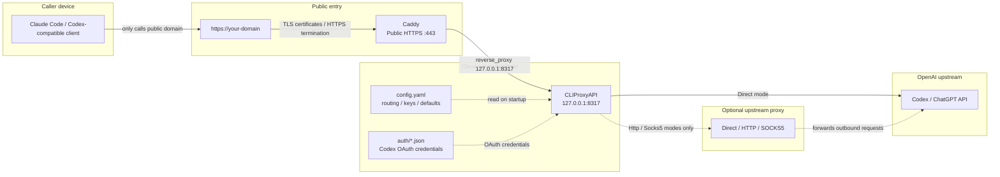
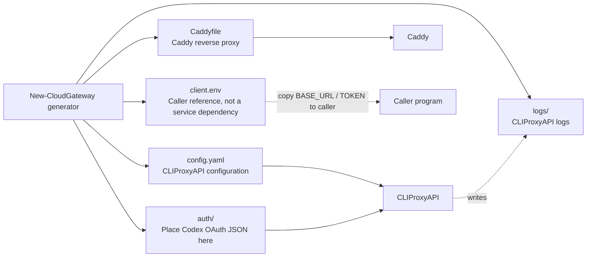

# CLIProxyAPI Cloud Gateway

[中文](README.md) | English

Run CLIProxyAPI safely on a cloud server: CLIProxyAPI listens only on local
`127.0.0.1`, while Caddy owns the public HTTPS entry point.

This project is not a multi-tenant billing platform and it is not CLIProxyAPI
itself. It is a lightweight deployment kit that generates safer, easier-to-debug
CLIProxyAPI + Caddy configuration for yourself or a small trusted user group.

Repository: <https://github.com/shuiyu486/cliproxy-cloud-gateway>

## How It Works

```text
client -> Caddy HTTPS -> CLIProxyAPI -> Codex / ChatGPT upstream
```



Key points:

- Callers only use `https://your-domain`; they do not directly reach CLIProxyAPI or upstream.
- Caddy is the only public entry point and handles HTTPS, certificates, and reverse proxying.
- CLIProxyAPI stays on the cloud server localhost and binds only to `127.0.0.1:8317`.
- `config.yaml` and `auth/*.json` feed CLIProxyAPI with routing, keys, defaults, and Codex OAuth credentials.
- Optional upstream proxy affects only outbound `CLIProxyAPI -> upstream` traffic; it does not affect callers connecting to Caddy.

## Features

- Windows and Linux generators.
- Generates `config.yaml`, `Caddyfile`, `client.env`, `auth/`, and `logs/`.
- Private-by-default listener: `host: "127.0.0.1"`.
- Caddy as the public HTTPS edge.
- Optional upstream proxy: `Direct`, `Http`, or `Socks5`.
- Automatic enabled `type=codex` OAuth JSON metadata sync.
- Generators do not print API keys to stdout.
- Windows and Linux doctor scripts.
- Carries the CLIProxyAPI hardening defaults that are relevant to cloud
  deployment.

## Quick Start

### Windows

```powershell
.\scripts\New-CloudGateway.ps1 `
  -Domain "api.example.com" `
  -OutputDir "C:\Services\cliproxy-gateway"
```

If the server needs a SOCKS5 proxy to reach Codex / ChatGPT upstream:

```powershell
.\scripts\New-CloudGateway.ps1 `
  -Domain "api.example.com" `
  -OutputDir "C:\Services\cliproxy-gateway" `
  -UpstreamProxyMode Socks5 `
  -UpstreamProxyUrl "127.0.0.1:7897"
```

Check the generated deployment:

```powershell
.\scripts\Test-CloudGatewayDoctor.ps1 -DeploymentDir "C:\Services\cliproxy-gateway"
```

### Linux

```bash
bash ./scripts/new-cloud-gateway.sh \
  --domain api.example.com \
  --output-dir /opt/cliproxy-gateway
```

If the server needs a SOCKS5 proxy to reach Codex / ChatGPT upstream:

```bash
bash ./scripts/new-cloud-gateway.sh \
  --domain api.example.com \
  --output-dir /opt/cliproxy-gateway \
  --upstream-proxy-mode socks5 \
  --upstream-proxy-url 127.0.0.1:7897
```

Check the generated deployment:

```bash
bash ./scripts/test-cloud-gateway-doctor.sh --deployment-dir /opt/cliproxy-gateway
```

## Generated Files

How Generated Files Are Used:



| File / directory | Purpose |
|---|---|
| `config.yaml` | CLIProxyAPI configuration. |
| `Caddyfile` | Caddy reverse proxy configuration. |
| `client.env` | Example environment variables for callers, including the gateway URL and the first client API key. |
| `auth/` | Place Codex OAuth JSON files here. |
| `logs/` | CLIProxyAPI log directory. |

`client.env` is not required by CLIProxyAPI or Caddy at runtime. It is only a convenience file for copying caller-side connection settings to your local machine or another host. It contains a sensitive API key and is git-ignored. Do not commit it.

## Upstream Proxy

`UpstreamProxyMode` controls only this leg:

```text
CLIProxyAPI -> Codex / ChatGPT upstream
```

It does not affect users connecting to your public Caddy domain.

| Mode | Behavior |
|---|---|
| `Direct` | Default. Omit `proxy-url` and remove stale auth JSON `proxy_url`. |
| `Http` | Normalize `127.0.0.1:7897` to `http://127.0.0.1:7897`. |
| `Socks5` | Normalize `127.0.0.1:7897` to `socks5://127.0.0.1:7897`. |

Prefer `Direct`. Use `Http` or `Socks5` only when the server must reach upstream
through a known proxy exit.

## Security Defaults

Generated CLIProxyAPI config keeps these defaults:

```yaml
host: "127.0.0.1"

tls:
  enable: false

remote-management:
  allow-remote: false
  secret-key: ""
  disable-control-panel: true

codex-header-defaults:
  user-agent: 'codex_cli_rs/0.114.0 (Mac OS 14.2.0; x86_64) vscode/1.111.0'

passthrough-headers: true

quota-exceeded:
  switch-project: true
  switch-preview-model: true
  antigravity-credits: false

request-retry: 1
max-retry-credentials: 1
max-retry-interval: 5

payload:
  filter:
    - models:
        - name: "gpt-*"
          protocol: "codex"
      params:
        - "reasoning"
        - "reasoning.effort"
        - "thinking"
```

## Auth JSON Sync

The generator scans enabled `type=codex` JSON files under `auth/`:

- missing `websockets` is set to `true`;
- explicit `websockets: false` is preserved;
- Direct mode removes stale `proxy_url`;
- Http/Socks5 mode writes the normalized `proxy_url`;
- token fields and full auth JSON are never printed.

## Doctor Checks

Windows:

```powershell
.\scripts\Test-CloudGatewayDoctor.ps1 -DeploymentDir "C:\Services\cliproxy-gateway"
```

Linux:

```bash
bash ./scripts/test-cloud-gateway-doctor.sh --deployment-dir /opt/cliproxy-gateway
```

Doctor checks generated files, localhost binding, disabled remote management,
bounded retry, payload filtering, Caddy routing, and auth JSON metadata.

## Caller Setup

Here, "caller" means Claude Code, a Codex-compatible client, a script, or any
program that sends requests to this gateway. The gateway itself only needs
`config.yaml` and the Caddy configuration; `client.env` is an extra reference
file generated so callers know which HTTPS URL and client API key to use.

After deployment, read `client.env`:

```bash
cat /opt/cliproxy-gateway/client.env
```

It contains:

```env
ANTHROPIC_BASE_URL=https://api.example.com
ANTHROPIC_AUTH_TOKEN=sk-...
```

Copy these values into your Claude Code / Anthropic-compatible client. If the
caller runs on a different machine, configure only these two values on that
machine; you do not need to copy the whole deployment directory.

## FAQ

**Why Caddy?**

Caddy handles public HTTPS, automatic certificate management, and reverse
proxying. CLIProxyAPI remains private and easier to reason about.

**Can I skip upstream proxy?**

Yes. `Direct` is the default. Use upstream proxy only when the server cannot
reach Codex / ChatGPT upstream reliably.

**Is this for many users?**

No. It is designed for yourself or a small trusted user group. If you need
quotas, billing, concurrency controls, and many users, use a more complete API
gateway.

**Will API keys be printed?**

No. Keys are written to `config.yaml` and `client.env`; both generated outputs
are git-ignored.

## Test

```powershell
.\tests\Test-CloudGateway.ps1
```

## License

Add a `LICENSE` file before publishing if needed. MIT License is a reasonable
default for this kind of deployment helper.
