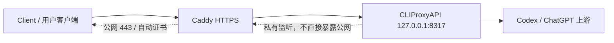

# CLIProxyAPI Cloud Gateway

中文 | [English](README.en-US.md)

把 CLIProxyAPI 安全地放到云服务器上使用：CLIProxyAPI 只监听本机
`127.0.0.1`，公网入口交给 Caddy 自动 HTTPS 反代。

这个项目不是多租户计费平台，也不是 CLIProxyAPI 本体。它是一个轻量部署包，帮你生成更安全、更容易排查的 CLIProxyAPI + Caddy 配置，适合自己或少量可信用户使用。

项目地址：<https://github.com/shuiyu486/cliproxy-cloud-gateway>

## 项目如何生效

```text
client -> Caddy HTTPS -> CLIProxyAPI -> Codex / ChatGPT 上游
```



关键点：

- 用户只访问 `https://你的域名`。
- Caddy 负责公网 HTTPS、证书和反代。
- CLIProxyAPI 只绑定 `127.0.0.1`，不直接暴露到公网。
- CLIProxyAPI 再访问 Codex / ChatGPT 上游。
- 如果服务器访问上游需要代理，只配置 `CLIProxyAPI -> 上游` 这一段，不影响用户访问 Caddy。

## 功能特性

- Windows / Linux 双平台生成部署文件。
- 生成 `config.yaml`、`Caddyfile`、`client.env`、`auth/` 和 `logs/` 目录。
- 默认安全私有监听：`host: "127.0.0.1"`。
- Caddy 作为公网 HTTPS 入口。
- 可选上游代理：`Direct`、`Http`、`Socks5`。
- 自动同步 enabled `type=codex` OAuth JSON 元数据。
- 生成器不向 stdout 打印 API key。
- 提供 Windows / Linux doctor 脚本检查部署结果。
- 保留 CodexToClaude 中适合云部署的 CLIProxyAPI 稳定性配置。

## 快速开始

### Windows

```powershell
.\scripts\New-CloudGateway.ps1 `
  -Domain "api.example.com" `
  -OutputDir "C:\Services\cliproxy-gateway"
```

如果云服务器访问 Codex / ChatGPT 上游需要 SOCKS5 代理：

```powershell
.\scripts\New-CloudGateway.ps1 `
  -Domain "api.example.com" `
  -OutputDir "C:\Services\cliproxy-gateway" `
  -UpstreamProxyMode Socks5 `
  -UpstreamProxyUrl "127.0.0.1:7897"
```

检查生成结果：

```powershell
.\scripts\Test-CloudGatewayDoctor.ps1 -DeploymentDir "C:\Services\cliproxy-gateway"
```

### Linux

```bash
bash ./scripts/new-cloud-gateway.sh \
  --domain api.example.com \
  --output-dir /opt/cliproxy-gateway
```

如果云服务器访问 Codex / ChatGPT 上游需要 SOCKS5 代理：

```bash
bash ./scripts/new-cloud-gateway.sh \
  --domain api.example.com \
  --output-dir /opt/cliproxy-gateway \
  --upstream-proxy-mode socks5 \
  --upstream-proxy-url 127.0.0.1:7897
```

检查生成结果：

```bash
bash ./scripts/test-cloud-gateway-doctor.sh --deployment-dir /opt/cliproxy-gateway
```

## 生成文件

| 文件/目录 | 用途 |
|---|---|
| `config.yaml` | CLIProxyAPI 配置。 |
| `Caddyfile` | Caddy 反代配置。 |
| `client.env` | 给调用方参考的环境变量示例，包含网关地址和第一个客户端 API key。 |
| `auth/` | 放置 Codex OAuth JSON。 |
| `logs/` | CLIProxyAPI 日志目录。 |

`client.env` 不是 CLIProxyAPI 或 Caddy 的运行依赖，只是方便你把接入信息复制到本机或其他机器上的调用方。它会包含敏感 API key，已经被 `.gitignore` 排除。不要提交它。

## 上游代理

`UpstreamProxyMode` 只控制这一段：

```text
CLIProxyAPI -> Codex / ChatGPT 上游
```

它不影响用户访问你的公网域名。

| 模式 | 行为 |
|---|---|
| `Direct` | 默认值，不写 `proxy-url`，并清理 auth JSON 中残留的 `proxy_url`。 |
| `Http` | `127.0.0.1:7897` 会归一化为 `http://127.0.0.1:7897`。 |
| `Socks5` | `127.0.0.1:7897` 会归一化为 `socks5://127.0.0.1:7897`。 |

建议优先使用 `Direct`。只有当服务器直连上游不稳定、必须走固定代理出口时，再使用 `Http` 或 `Socks5`。

## 安全默认值

生成的 CLIProxyAPI 配置会保留这些关键默认值：

```yaml
host: "127.0.0.1"

tls:
  enable: false

remote-management:
  allow-remote: false
  secret-key: ""
  disable-control-panel: true

codex-header-defaults:
  user-agent: 'codex_cli_rs/0.114.0 (Mac OS 14.2.0; x86_64) vscode/1.111.0'

passthrough-headers: true

quota-exceeded:
  switch-project: true
  switch-preview-model: true
  antigravity-credits: false

request-retry: 1
max-retry-credentials: 1
max-retry-interval: 5

payload:
  filter:
    - models:
        - name: "gpt-*"
          protocol: "codex"
      params:
        - "reasoning"
        - "reasoning.effort"
        - "thinking"
```

说明：

- `host: "127.0.0.1"`：CLIProxyAPI 只允许本机访问。
- `tls.enable: false`：HTTPS 由 Caddy 负责，CLIProxyAPI 不直接处理公网 TLS。
- `remote-management.allow-remote: false`：不开放远程管理。
- `codex-header-defaults.user-agent`：为 Codex OAuth 上游请求提供稳定 UA fallback。
- `passthrough-headers: true`：透传上游 `X-Codex-*` 用量 header。
- bounded retry：避免失败被长时间重试伪装成卡住。
- `payload.filter`：过滤 Claude Code 请求中容易影响 Codex 适配的 thinking/reasoning 字段。

## Auth JSON 同步

生成器会扫描 `auth/` 目录下 enabled `type=codex` 的 JSON 文件：

- 缺少 `websockets` 时补 `true`。
- 已有 `websockets: false` 时保持原值。
- `Direct` 模式会移除旧的 `proxy_url`。
- `Http` / `Socks5` 模式会写入归一化后的 `proxy_url`。
- 不会输出 `access_token`、`refresh_token`、`id_token` 或完整 auth JSON。

## Doctor 检查

Windows:

```powershell
.\scripts\Test-CloudGatewayDoctor.ps1 -DeploymentDir "C:\Services\cliproxy-gateway"
```

Linux:

```bash
bash ./scripts/test-cloud-gateway-doctor.sh --deployment-dir /opt/cliproxy-gateway
```

doctor 会检查：

- `config.yaml`、`Caddyfile`、`client.env` 是否存在。
- CLIProxyAPI 是否绑定 `127.0.0.1`。
- 远程管理和控制面板是否关闭。
- retry、payload filter、Codex UA、header passthrough 是否存在。
- Caddy 是否反代到本机 CLIProxyAPI。
- auth JSON 的 `websockets` 和 `proxy_url` 是否与配置一致。

## 调用方接入

这里的“调用方”指 Claude Code、Codex 兼容客户端、脚本或任何会请求这个网关的程序。网关本身只需要 `config.yaml` 和 Caddy 配置；`client.env` 只是生成器额外写出的参考文件，用来告诉调用方应该连到哪个 HTTPS 地址、使用哪个客户端 API key。

部署完成后，可以查看 `client.env`：

```bash
cat /opt/cliproxy-gateway/client.env
```

内容类似：

```env
ANTHROPIC_BASE_URL=https://api.example.com
ANTHROPIC_AUTH_TOKEN=sk-...
```

把这两个值填入你的 Claude Code / Anthropic-compatible 客户端即可。如果调用方和网关不在同一台机器，只需要把这两个值配置到调用方所在环境，不需要复制整个部署目录。

## 常见问题

**为什么需要 Caddy？**

Caddy 负责公网 HTTPS、证书自动申请/续期和标准反代。CLIProxyAPI 只监听本机，暴露面更小，排查也更清晰。

**可以不用上游代理吗？**

可以。默认就是 `Direct`。只有服务器访问 Codex / ChatGPT 上游不稳定时，才需要配置上游代理。

**这个项目适合很多用户共享吗？**

不适合做复杂多租户平台。它适合自己或少量可信用户。如果需要额度、计费、并发和大量用户管理，应考虑更完整的网关系统。

**API key 会不会被打印出来？**

不会。生成器只打印文件路径，API key 写入 `config.yaml` 和 `client.env`。这些生成物已被 `.gitignore` 排除。

## 测试

```powershell
.\tests\Test-CloudGateway.ps1
```

测试会覆盖模板默认值、Windows/Linux 生成器、上游代理归一化、auth metadata 同步、doctor 脚本和文档关键内容。

## 许可证

建议发布到 GitHub 前补充 `LICENSE`。如果没有特别要求，MIT License 通常足够。
