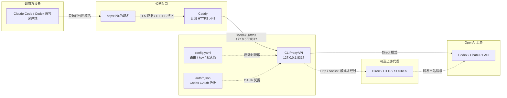
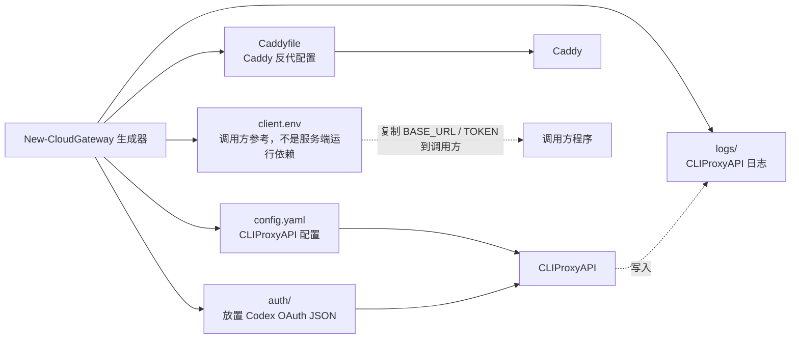

# CLIProxyAPI Cloud Gateway

中文 | [English](README.en-US.md)

把 CLIProxyAPI 安全地放到云服务器上使用：CLIProxyAPI 只监听本机
`127.0.0.1`，公网入口交给 Caddy 自动 HTTPS 反代。

这个项目不是多租户计费平台，也不是 CLIProxyAPI 本体。它是一个轻量部署包，帮你生成更安全、更容易排查的 CLIProxyAPI + Caddy 配置，适合自己或少量可信用户使用。

项目地址：<https://github.com/shuiyu486/cliproxy-cloud-gateway>

## 先选使用模式

| 场景 | 推荐入口 |
|---|---|
| Linux 云服务器正式部署 | `bash ./scripts/install-cloud-gateway.sh --domain api.example.com --install-dir /opt/cliproxy-gateway` |
| 只生成配置文件 | `scripts/new-cloud-gateway.sh` 或 `scripts/New-CloudGateway.ps1` |
| Windows 临时/长期当局域网网关 | `scripts/Start-CloudGatewayLan.ps1` |
| 检查已有部署 | `scripts/test-cloud-gateway-doctor.sh` 或 `scripts/Test-CloudGatewayDoctor.ps1` |

如果你是第一次部署到云服务器，优先看“Linux 云端一键部署”。如果只是复现 Windows + Mac 的局域网用法，看“局域网模式”。

## 快速开始

### Linux 云端一键部署

推荐在云服务器上运行：

```bash
bash ./scripts/install-cloud-gateway.sh \
  --domain api.example.com \
  --install-dir /opt/cliproxy-gateway
```

脚本会：

- 生成 `config.yaml`、`Caddyfile`、`client.env`、`auth/` 和 `logs/`。
- 缺少时从固定 GitHub release 来源下载 CLIProxyAPI 和 Caddy；已有文件不覆盖。
- 从 `linux/cliproxy.service.template` 生成并启用 CLIProxyAPI systemd 服务。
- 安装并重载 Caddyfile。
- 运行 doctor 检查。
- 只打印路径、域名和状态，不打印 API key。

如果云服务器访问 Codex / ChatGPT 上游需要代理：

```bash
bash ./scripts/install-cloud-gateway.sh \
  --domain api.example.com \
  --install-dir /opt/cliproxy-gateway \
  --upstream-proxy-mode socks5 \
  --upstream-proxy-url 127.0.0.1:7897
```

如果只想预生成文件、不改 systemd/Caddy：

```bash
bash ./scripts/install-cloud-gateway.sh \
  --domain api.example.com \
  --install-dir /opt/cliproxy-gateway \
  --skip-download \
  --skip-systemd \
  --skip-caddy-reload
```

## 项目如何生效

```text
client -> Caddy HTTPS -> CLIProxyAPI -> Codex / ChatGPT 上游
```



关键点：

- 调用方只访问 `https://你的域名`，不会直接访问 CLIProxyAPI 或上游。
- Caddy 是唯一公网入口，负责 HTTPS、证书和反代。
- CLIProxyAPI 位于云服务器本机，只绑定 `127.0.0.1:8317`，不直接暴露到公网。
- `config.yaml` 和 `auth/*.json` 是 CLIProxyAPI 的输入，分别提供路由/key/默认值和 Codex OAuth 凭据。
- 可选上游代理只影响 `CLIProxyAPI -> 上游` 的出站请求，不影响调用方访问 Caddy。

## 功能特性

- Linux 云端一键部署脚本可生成配置、下载依赖、安装 systemd 服务并重载 Caddy。
- Windows / Linux 双平台生成部署文件。
- 生成 `config.yaml`、`Caddyfile`、`client.env`、`auth/` 和 `logs/` 目录。
- 局域网一键测试脚本可在缺少时自动下载 CLIProxyAPI 和 Caddy 二进制。
- 默认安全私有监听：`host: "127.0.0.1"`。
- Caddy 作为公网 HTTPS 入口。
- 可选上游代理：`Direct`、`Http`、`Socks5`。
- 自动同步 enabled `type=codex` OAuth JSON 元数据。
- 生成器不向 stdout 打印 API key。
- 提供 Windows / Linux doctor 脚本检查部署结果。
- 保留 CodexToClaude 中适合云部署的 CLIProxyAPI 稳定性配置。

## 生成文件

生成器输出如何落地：



| 文件/目录 | 用途 |
|---|---|
| `config.yaml` | CLIProxyAPI 配置。 |
| `Caddyfile` | Caddy 反代配置。 |
| `client.env` | 给调用方参考的环境变量示例，包含网关地址和第一个客户端 API key。 |
| `auth/` | 放置 Codex OAuth JSON。 |
| `logs/` | CLIProxyAPI 日志目录。 |

`client.env` 不是 CLIProxyAPI 或 Caddy 的运行依赖，只是方便你把接入信息复制到本机或其他机器上的调用方。它会包含敏感 API key，已经被 `.gitignore` 排除。不要提交它。

## 只生成配置

Windows：

```powershell
.\scripts\New-CloudGateway.ps1 `
  -Domain "api.example.com" `
  -OutputDir "C:\Services\cliproxy-gateway"
```

Linux：

```bash
bash ./scripts/new-cloud-gateway.sh \
  --domain api.example.com \
  --output-dir /opt/cliproxy-gateway
```

## Doctor 检查

检查生成结果：

```powershell
.\scripts\Test-CloudGatewayDoctor.ps1 -DeploymentDir "C:\Services\cliproxy-gateway"
```

```bash
bash ./scripts/test-cloud-gateway-doctor.sh --deployment-dir /opt/cliproxy-gateway
```

## 获取 Codex OAuth JSON

Linux 云服务器不需要图形浏览器；推荐在服务器 SSH 里使用 CLIProxyAPI 的设备码登录：

```bash
cd /opt/cliproxy-gateway
./cli-proxy-api/cli-proxy-api -config ./config.yaml -codex-device-login
```

一键安装脚本默认会把 CLIProxyAPI 二进制放在 `/opt/cliproxy-gateway/cli-proxy-api/cli-proxy-api`；如果你安装时用了自定义 `--binary-path`，请改用你的实际路径。

命令会在终端输出登录 URL / 设备码。你可以在自己电脑的浏览器里打开并授权；服务器端 CLIProxyAPI 会继续等待授权结果，并把 Codex OAuth JSON 写入 `config.yaml` 指定的 `auth-dir`：

```text
/opt/cliproxy-gateway/auth/*.json
```

也可以在可信本机用同版本 CLIProxyAPI 登录生成 JSON，再复制到云服务器：

```bash
scp codex*.json user@server:/opt/cliproxy-gateway/auth/
ssh user@server 'chmod 600 /opt/cliproxy-gateway/auth/*.json'
```

注意：

- 这里需要的是 CLIProxyAPI 自己登录生成的 `type=codex` OAuth JSON。不要直接把 `~/.codex/auth.json` 当作这里的 OAuth 文件。
- OAuth JSON 通常不是按本机硬件绑定，但它等同账号登录凭据。不要提交 GitHub、不要贴日志、不要发给别人。
- 不要让本机和云服务器长期并发使用同一份 OAuth JSON，refresh token 轮换可能导致其中一边失效。
- 如果本机生成的 JSON 在云服务器上失败，优先检查服务器出口 IP、代理出口、账号权限或上游风控；这类失败通常不是文件路径问题。

## 获取 auth 后启动网关

如果你使用的是 Linux 云端一键部署，并且安装时没有加 `--skip-systemd` / `--skip-caddy-reload`，安装脚本已经创建并启动了 systemd 服务。获取或复制 auth JSON 后，重启 CLIProxyAPI 服务让它重新加载 `auth/*.json`：

```bash
sudo systemctl restart cliproxy
sudo systemctl status cliproxy --no-pager
sudo systemctl status caddy --no-pager
```

查看 CLIProxyAPI 日志：

```bash
sudo journalctl -u cliproxy -n 100 --no-pager
```

如果安装时通过 `--service-name` 改过服务名，请把上面的 `cliproxy` 换成你的服务名。

如果安装时用了 `--skip-systemd`，可以先手动运行 CLIProxyAPI 做检查：

```bash
cd /opt/cliproxy-gateway
./cli-proxy-api/cli-proxy-api -config ./config.yaml
```

如果安装时用了 `--skip-caddy-reload`，还需要手动安装并重载 Caddyfile：

```bash
sudo cp /opt/cliproxy-gateway/Caddyfile /etc/caddy/Caddyfile
sudo caddy validate --config /etc/caddy/Caddyfile
sudo systemctl reload caddy
```

服务正常后，调用方只需要使用 `client.env` 里的公网地址和 API key；见“调用方接入”。

## Auth JSON 同步

生成器会扫描 `auth/` 目录下 enabled `type=codex` 的 JSON 文件：

- 缺少 `websockets` 时补 `true`。
- 已有 `websockets: false` 时保持原值。
- `Direct` 模式会移除旧的 `proxy_url`。
- `Http` / `Socks5` 模式会写入归一化后的 `proxy_url`。
- 不会输出 `access_token`、`refresh_token`、`id_token` 或完整 auth JSON。

## 上游代理

`UpstreamProxyMode` 只控制这一段：

```text
CLIProxyAPI -> Codex / ChatGPT 上游
```

它不影响用户访问你的公网域名。

| 模式 | 行为 |
|---|---|
| `Direct` | 默认值，不写 `proxy-url`，并清理 auth JSON 中残留的 `proxy_url`。 |
| `Http` | `127.0.0.1:7897` 会归一化为 `http://127.0.0.1:7897`。 |
| `Socks5` | `127.0.0.1:7897` 会归一化为 `socks5://127.0.0.1:7897`。 |

建议优先使用 `Direct`。只有当服务器直连上游不稳定、必须走固定代理出口时，再使用 `Http` 或 `Socks5`。

## 局域网模式

如果想把当前 Windows 物理机临时或长期当作“云服务器”、局域网内其他电脑当作调用方，可以运行：

```powershell
.\scripts\Start-CloudGatewayLan.ps1 `
  -DeploymentDir "C:\Services\cliproxy-gateway" `
  -BinaryPath "C:\Services\cliproxy-gateway\cli-proxy-api\cli-proxy-api.exe" `
  -ServerHost "192.168.1.10" `
  -LanPort 8080
```

脚本会重新生成部署文件、同步 auth JSON metadata、生成 `Caddyfile.lan`，并在新窗口启动 CLIProxyAPI 和 Caddy。缺少 `cli-proxy-api.exe` 或 `caddy.exe` 时，它会从固定 GitHub release 来源下载；如果目标文件已存在则跳过，不覆盖。它只打印 auth 文件摘要，不打印 token 内容。`-ServerHost` 必须是这台 Windows 机器真实持有的局域网 IPv4；不确定时可以省略，脚本会自动选择一个非虚拟网卡地址。如果默认 CLIProxyAPI 私有端口 `8317` 已被其它本机服务占用，局域网测试脚本会自动选择附近空闲端口，并让 Caddy 反代到该端口。

如果指定 `-UpstreamProxyMode Http` 或 `Socks5`，脚本会先检查 `-UpstreamProxyUrl` 的主机端口是否可连接；例如本机实际开放的是 `127.0.0.1:7890` 时，不要误写成未监听的 `127.0.0.1:7897`。如果脚本提示 `Enabled Codex auth JSON file(s): 0`，说明 `auth/` 根层没有 enabled `type=codex` JSON。CLIProxyAPI 启动窗口最开始可能先显示 `0 clients`，随后日志里应出现 `full client load complete - 1 clients (1 auth files ...)`；Codex OAuth JSON 会计入 `auth files`，不一定显示为 `Codex keys`。

Linux 也可以使用局域网测试脚本：

```bash
bash ./scripts/start-cloud-gateway-lan.sh \
  --output-dir /opt/cliproxy-gateway \
  --server-host 192.168.1.10 \
  --lan-port 8080
```

该脚本会在缺少时下载 Linux 版 CLIProxyAPI 和 Caddy；已有二进制则跳过。

## 调用方接入

这里的“调用方”指 Claude Code、Codex 兼容客户端、脚本或任何会请求这个网关的程序。网关本身只需要 `config.yaml` 和 Caddy 配置；`client.env` 只是生成器额外写出的参考文件，用来告诉调用方应该连到哪个 HTTPS 地址、使用哪个客户端 API key。

部署完成后，可以查看 `client.env`：

```bash
cat /opt/cliproxy-gateway/client.env
```

内容类似：

```env
ANTHROPIC_BASE_URL=https://api.example.com
ANTHROPIC_AUTH_TOKEN=sk-...
```

把这两个值填入你的 Claude Code / Anthropic-compatible 客户端即可。如果调用方和网关不在同一台机器，只需要把这两个值配置到调用方所在环境，不需要复制整个部署目录。

## 安全默认值

生成的 CLIProxyAPI 配置会保留这些关键默认值：

```yaml
host: "127.0.0.1"

tls:
  enable: false

remote-management:
  allow-remote: false
  secret-key: ""
  disable-control-panel: true

codex-header-defaults:
  user-agent: 'codex_cli_rs/0.114.0 (Mac OS 14.2.0; x86_64) vscode/1.111.0'

passthrough-headers: true

quota-exceeded:
  switch-project: true
  switch-preview-model: true
  antigravity-credits: false

request-retry: 1
max-retry-credentials: 1
max-retry-interval: 5
```

说明：

- `host: "127.0.0.1"`：CLIProxyAPI 只允许本机访问。
- `tls.enable: false`：HTTPS 由 Caddy 负责，CLIProxyAPI 不直接处理公网 TLS。
- `remote-management.allow-remote: false`：不开放远程管理。
- `codex-header-defaults.user-agent`：为 Codex OAuth 上游请求提供稳定 UA fallback。
- `passthrough-headers: true`：透传上游 `X-Codex-*` 用量 header。
- bounded retry：避免失败被长时间重试伪装成卡住。

默认不配置 `payload.filter`，会透传 Claude Code 当前请求中的 reasoning/thinking/effort 字段，让 `/effort` 或客户端自身设置自然生效。如果遇到 thinking 输出过长、重复字符、TUI 展示异常，或需要临时关闭思考相关字段，可以手动在 `config.yaml` 中添加：

```yaml
payload:
  filter:
    - models:
        - name: "gpt-*"
          protocol: "codex"
      params:
        - "reasoning"
        - "reasoning.effort"
        - "thinking"
```

## 常见问题

**为什么需要 Caddy？**

Caddy 负责公网 HTTPS、证书自动申请/续期和标准反代。CLIProxyAPI 只监听本机，暴露面更小，排查也更清晰。

**可以不用上游代理吗？**

可以。默认就是 `Direct`。只有服务器访问 Codex / ChatGPT 上游不稳定时，才需要配置上游代理。

**Windows 长期开放 LAN 端口安全吗？**

只建议在可信局域网内使用，且不要在路由器上把 LAN 端口转发到公网。长期让 Mac 访问 Windows 网关时，推荐在 Windows 防火墙规则里把 TCP 端口限制为只允许 Mac 的固定局域网 IP。Windows 本机也可以复用同一套 Caddy/CLIProxyAPI，把 `ANTHROPIC_BASE_URL` 设为 `http://127.0.0.1:<LanPort>`，不需要再启动另一份 CLIProxyAPI。

**这个项目适合很多用户共享吗？**

不适合做复杂多租户平台。它适合自己或少量可信用户。如果需要额度、计费、并发和大量用户管理，应考虑更完整的网关系统。

**API key 会不会被打印出来？**

不会。生成器只打印文件路径，API key 写入 `config.yaml` 和 `client.env`。这些生成物已被 `.gitignore` 排除。

## 更多文档

- 详细部署说明：[`docs/deployment.md`](docs/deployment.md)
- Linux systemd 模板：[`linux/cliproxy.service.template`](linux/cliproxy.service.template)

## 测试

```powershell
.\tests\Test-CloudGateway.ps1
```

测试会覆盖模板默认值、Windows/Linux 生成器、Linux 云端安装器、上游代理归一化、auth metadata 同步、doctor 脚本和文档关键内容。

## 许可证

建议发布到 GitHub 前补充 `LICENSE`。如果没有特别要求，MIT License 通常足够。
