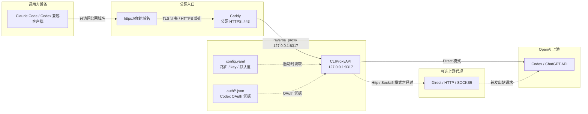
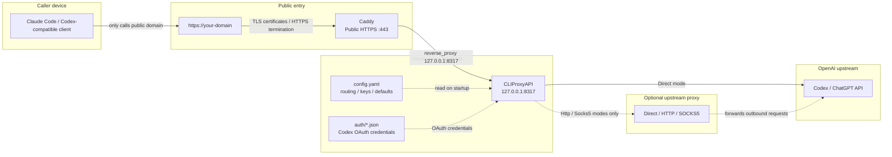

# README Flow Diagrams Implementation Plan

> **For agentic workers:** REQUIRED SUB-SKILL: Use superpowers:subagent-driven-development (recommended) or superpowers:executing-plans to implement this plan task-by-task. Steps use checkbox (`- [ ]`) syntax for tracking.

**Goal:** Replace the compressed README runtime chain with clearer runtime and generated-file diagrams in Chinese and English.

**Architecture:** Keep documentation as plain Markdown with Mermaid diagrams. Add tests that assert the new diagram structure and key labels so future edits do not collapse the explanation back into a vague single chain.

**Tech Stack:** Markdown, Mermaid, PowerShell regression tests, Git.

---

## File Structure

- Modify `tests/Test-CloudGateway.ps1`: update README assertions first so the current README fails for the missing zone labels and generated-files diagram.
- Modify `README.md`: replace the top runtime diagram and add a generated-files diagram near `## 生成文件`.
- Modify `README.en-US.md`: mirror the Chinese README structure and meaning.
- No runtime scripts, templates, or doctor logic should change.

---

### Task 1: Add Failing README Diagram Assertions

**Files:**
- Modify: `tests/Test-CloudGateway.ps1`
- Test: `tests/Test-CloudGateway.ps1`

- [x] **Step 1: Replace Chinese README diagram assertions**

In the `$Readme` block, replace the old simple-flow assertions:

```powershell
Assert-Contains $Readme 'flowchart LR' "default README includes Mermaid flowchart"
Assert-Contains $Readme 'Client["Client / 用户客户端"]' "default README flowchart starts with client"
Assert-Contains $Readme 'Caddy["Caddy HTTPS"]' "default README flowchart includes Caddy HTTPS"
Assert-Contains $Readme 'CLIProxyAPI["CLIProxyAPI' "default README flowchart includes CLIProxyAPI"
Assert-Contains $Readme 'Upstream["Codex / ChatGPT 上游"]' "default README flowchart includes upstream"
Assert-Contains $Readme 'client -> Caddy HTTPS -> CLIProxyAPI -> Codex / ChatGPT 上游' "default README includes plain-text flow"
```

with these assertions:

```powershell
Assert-Contains $Readme 'flowchart LR' "default README includes Mermaid flowchart"
Assert-Contains $Readme 'subgraph CallerZone["调用方设备"]' "default README separates caller device zone"
Assert-Contains $Readme 'subgraph PublicZone["公网入口"]' "default README separates public entry zone"
Assert-Contains $Readme 'subgraph ServerZone["云服务器本机"]' "default README separates cloud server localhost zone"
Assert-Contains $Readme 'subgraph ProxyZone["可选上游代理"]' "default README separates optional upstream proxy zone"
Assert-Contains $Readme 'subgraph UpstreamZone["OpenAI 上游"]' "default README separates upstream zone"
Assert-Contains $Readme 'Caller["Claude Code / Codex 兼容客户端"]' "default README flowchart starts with caller"
Assert-Contains $Readme 'Caddy["Caddy\n公网 HTTPS :443"]' "default README flowchart includes Caddy HTTPS"
Assert-Contains $Readme 'CLIProxyAPI["CLIProxyAPI\n127.0.0.1:8317"]' "default README flowchart includes localhost CLIProxyAPI"
Assert-Contains $Readme 'Auth["auth/*.json\nCodex OAuth 凭据"]' "default README flowchart includes auth JSON input"
Assert-Contains $Readme 'Upstream["Codex / ChatGPT API"]' "default README flowchart includes upstream"
Assert-Contains $Readme 'client -> Caddy HTTPS -> CLIProxyAPI -> Codex / ChatGPT 上游' "default README includes plain-text flow"
Assert-Contains $Readme '生成器输出如何落地' "default README includes generated-files flow section"
Assert-Contains $Readme 'Generator["New-CloudGateway 生成器"]' "default README generated-files diagram starts with generator"
Assert-Contains $Readme 'ClientEnv["client.env\n调用方参考，不是服务端运行依赖"]' "default README generated-files diagram clarifies client.env role"
```

- [x] **Step 2: Replace English README diagram assertions**

In the `$EnglishReadme` block, keep the existing core assertions and add English equivalents:

```powershell
Assert-Contains $EnglishReadme 'flowchart LR' "English README includes Mermaid flowchart"
Assert-Contains $EnglishReadme 'subgraph CallerZone["Caller device"]' "English README separates caller device zone"
Assert-Contains $EnglishReadme 'subgraph PublicZone["Public entry"]' "English README separates public entry zone"
Assert-Contains $EnglishReadme 'subgraph ServerZone["Cloud server localhost"]' "English README separates cloud server localhost zone"
Assert-Contains $EnglishReadme 'subgraph ProxyZone["Optional upstream proxy"]' "English README separates optional upstream proxy zone"
Assert-Contains $EnglishReadme 'subgraph UpstreamZone["OpenAI upstream"]' "English README separates upstream zone"
Assert-Contains $EnglishReadme 'Caller["Claude Code / Codex-compatible client"]' "English README flowchart starts with caller"
Assert-Contains $EnglishReadme 'Caddy["Caddy\nPublic HTTPS :443"]' "English README flowchart includes Caddy HTTPS"
Assert-Contains $EnglishReadme 'CLIProxyAPI["CLIProxyAPI\n127.0.0.1:8317"]' "English README flowchart includes localhost CLIProxyAPI"
Assert-Contains $EnglishReadme 'Auth["auth/*.json\nCodex OAuth credentials"]' "English README flowchart includes auth JSON input"
Assert-Contains $EnglishReadme 'Upstream["Codex / ChatGPT API"]' "English README flowchart includes upstream"
Assert-Contains $EnglishReadme 'How Generated Files Are Used' "English README includes generated-files flow section"
Assert-Contains $EnglishReadme 'Generator["New-CloudGateway generator"]' "English README generated-files diagram starts with generator"
Assert-Contains $EnglishReadme 'ClientEnv["client.env\nCaller reference, not a service dependency"]' "English README generated-files diagram clarifies client.env role"
```

- [x] **Step 3: Run tests and verify RED**

Run:

```powershell
.\tests\Test-CloudGateway.ps1
```

Expected: fails on the new README diagram assertions, because the current README still has only the simple Mermaid chain.

---

### Task 2: Replace README Diagrams And Surrounding Text

**Files:**
- Modify: `README.md`
- Modify: `README.en-US.md`
- Test: `tests/Test-CloudGateway.ps1`

- [x] **Step 1: Replace Chinese runtime diagram**

In `README.md`, replace the current Mermaid block under `## 项目如何生效` with:



Update the key points to mention the five zones and that `config.yaml` / `auth/*.json` feed CLIProxyAPI.

- [x] **Step 2: Add Chinese generated-files diagram**

Under `## 生成文件`, before the table, add:

```markdown
生成器输出如何落地：

```mermaid
flowchart LR
  Generator["New-CloudGateway 生成器"] --> Config["config.yaml\nCLIProxyAPI 配置"]
  Generator --> Caddyfile["Caddyfile\nCaddy 反代配置"]
  Generator --> ClientEnv["client.env\n调用方参考，不是服务端运行依赖"]
  Generator --> AuthDir["auth/\n放置 Codex OAuth JSON"]
  Generator --> Logs["logs/\nCLIProxyAPI 日志"]

  Config --> CLIProxyAPI["CLIProxyAPI"]
  AuthDir --> CLIProxyAPI
  Logs <-. "写入" .- CLIProxyAPI
  Caddyfile --> Caddy["Caddy"]
  ClientEnv -. "复制 BASE_URL / TOKEN 到调用方" .-> Caller["调用方程序"]
```
```

- [x] **Step 3: Replace English runtime diagram**

In `README.en-US.md`, replace the Mermaid block under `## How It Works` with:



Mirror the Chinese key points in English.

- [x] **Step 4: Add English generated-files diagram**

Under `## Generated Files`, before the table, add:

```markdown
How Generated Files Are Used:

```mermaid
flowchart LR
  Generator["New-CloudGateway generator"] --> Config["config.yaml\nCLIProxyAPI configuration"]
  Generator --> Caddyfile["Caddyfile\nCaddy reverse proxy"]
  Generator --> ClientEnv["client.env\nCaller reference, not a service dependency"]
  Generator --> AuthDir["auth/\nPlace Codex OAuth JSON here"]
  Generator --> Logs["logs/\nCLIProxyAPI logs"]

  Config --> CLIProxyAPI["CLIProxyAPI"]
  AuthDir --> CLIProxyAPI
  Logs <-. "writes" .- CLIProxyAPI
  Caddyfile --> Caddy["Caddy"]
  ClientEnv -. "copy BASE_URL / TOKEN to caller" .-> Caller["Caller program"]
```
```

- [x] **Step 5: Run tests and verify GREEN**

Run:

```powershell
.\tests\Test-CloudGateway.ps1
```

Expected: `Passed` count increases, `Failed: 0`.

---

### Task 3: Final Verification And Publish

**Files:**
- Commit: `docs/superpowers/plans/2026-06-02-readme-flow-diagrams.md`
- Commit: `docs/superpowers/specs/2026-06-02-readme-flow-diagrams-design.md`
- Commit: `README.md`
- Commit: `README.en-US.md`
- Commit: `tests/Test-CloudGateway.ps1`

- [x] **Step 1: Check formatting**

Run:

```powershell
git diff --check
```

Expected: exit code `0`, no whitespace warnings.

- [x] **Step 2: Check changed files**

Run:

```powershell
git status --short --branch
git diff --stat
```

Expected: only the plan, README files, and test file are changed since the last commit, plus the already committed design spec being ahead of origin.

- [ ] **Step 3: Commit implementation**

Run:

```powershell
git add docs/superpowers/plans/2026-06-02-readme-flow-diagrams.md README.md README.en-US.md tests/Test-CloudGateway.ps1
git commit -m "Improve README flow diagrams"
```

Expected: commit succeeds.

- [ ] **Step 4: Push all local commits**

Run:

```powershell
git push
```

Expected: remote `main` advances with the design spec and implementation commits.

- [ ] **Step 5: Confirm remote SHA**

Run:

```powershell
git rev-parse HEAD
git ls-remote origin refs/heads/main
git status --short --branch
```

Expected: local `HEAD` SHA equals remote `refs/heads/main`; working tree is clean.
